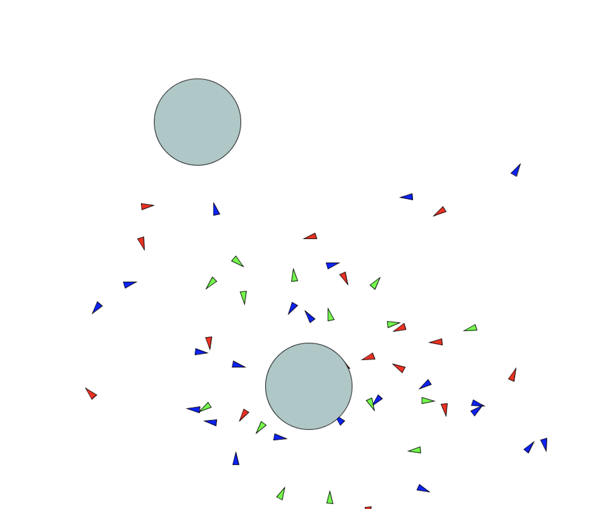
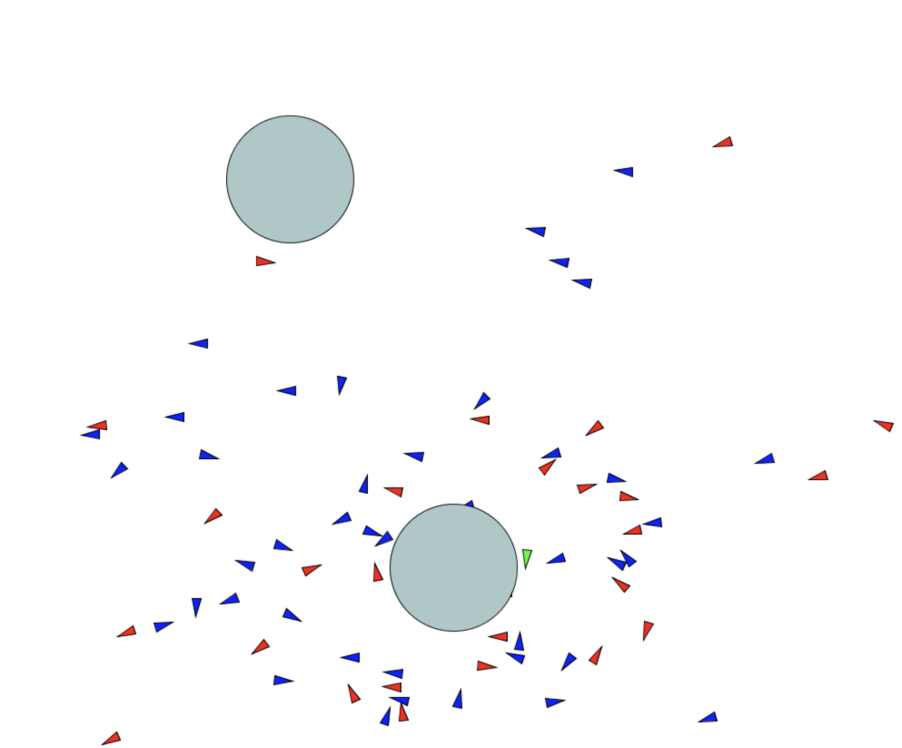

# ECOSYSTEM PROJECT

## Description
In this project, I implemented a simple predator, prey, food scenario frequently encountered in an ecosystem. In this ecosystem is set in an environment of abundance when the food source is almost unlimited. The interactions between the organisms are as follows

- The there is a main food source which attract the movers, but there is also a predator which also attracts the movers but with 75% the attractive force of the food source (as if the movers are sort of aware of the predator and do not fully commit to finding out what it is).

- The movers repell each other, and bounce off the edge of the screen so as to not leave the abundant ecosystem.

- When the young movers (red and blue) feed on the food source up to a certain threshold, they transform into the mature generation, denoted by the color green.

- The mature movers remain green and continue feeding until they reach the next stage in their lifecycle which is reproduction. Here, the movers, as if by mitosis, create another young mover and they themselves become young movers again: sustaining the population

- Whenever a mover of any kind comes into close proximity with the predator, it gets eaten. 

## Difficulties
- One of the main challenges I faced was setting an adequate threshold for the movers so they didn't "grow" too fast. 

- I initially started with making the predator repell the movers, but that didn't work because the movers would never get eaten by the predator.

- I also wanted to simulate a real mitosis by halfing the mass of the movers, but that would require really large movers which would entirely fill up the scree.
 
## Media Resources
[Link to video]()

