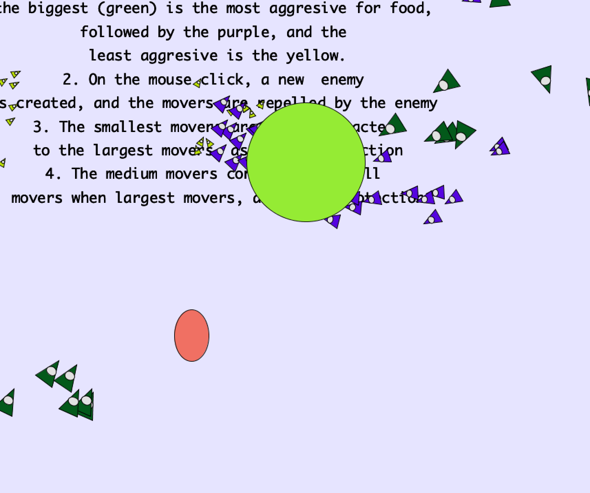
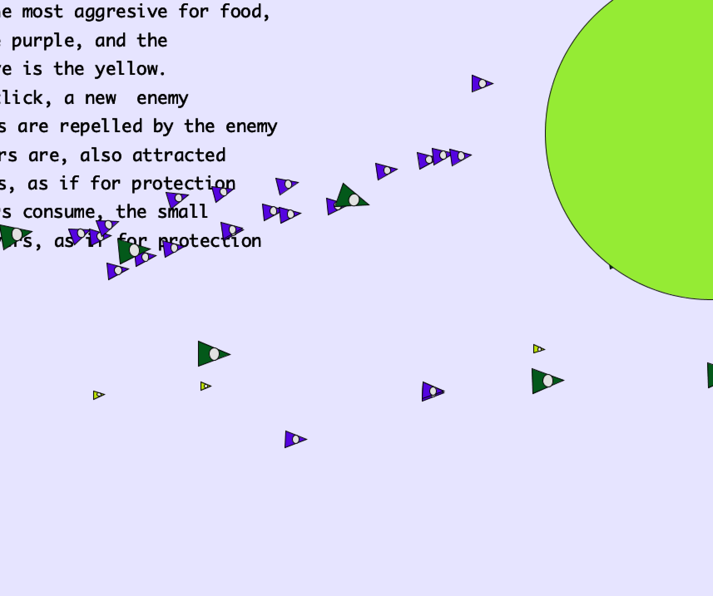
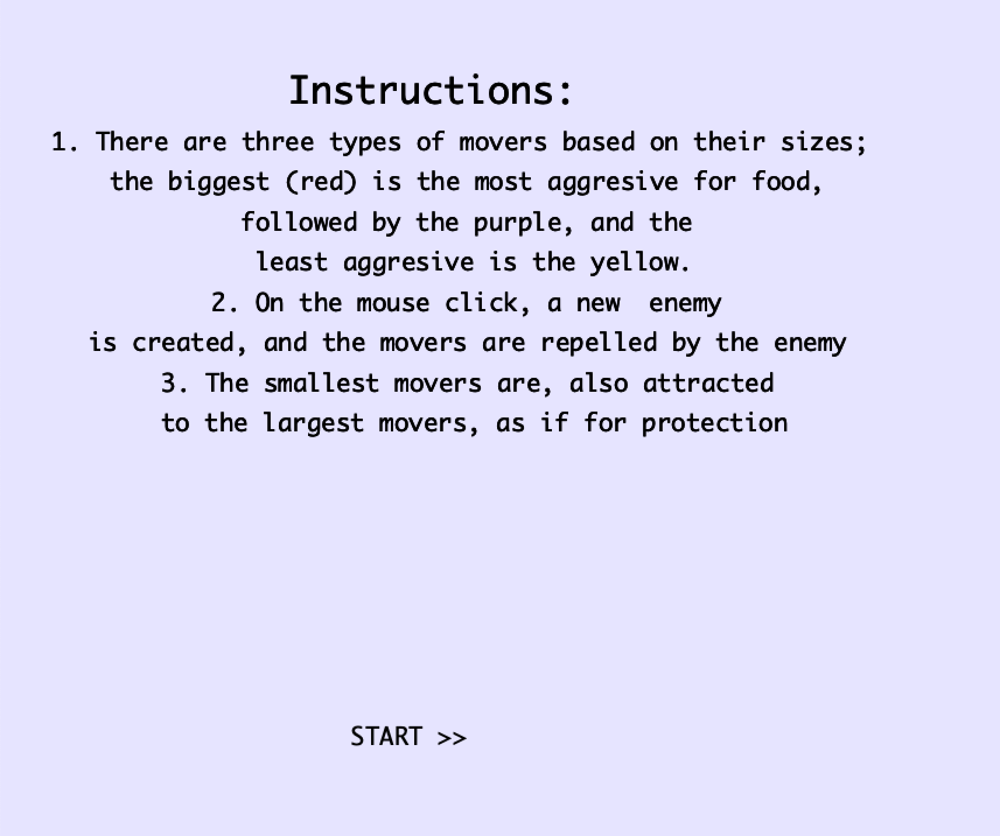

## Concept
My initial concept was to base the ecosystem off of the game of life which has rules the following rules: 
1. Any live cell with two or three live neighbours lives on to the next generation.
2. Any live cell with more than three live neighbours dies, as if by overpopulation.
3. Any dead cell with exactly three live neighbours becomes a live cell, as if by reproduction.

However, these rules were not very clear to implement, and the interaction were limited. So I decided to adapt it with the following three main features which are feeding, reproduction, and death. In the ecosystem, there are three movers that the ecosystem is based around. 

- The first is the green mover which is the largest mover in the ecosystem. Due to its size, it is the most aggresive towards food. The level of aggression is inversely related to the amount of food present. Meaning, the the smaller the amount of food remaining at that time, the more aggresive the movers will be. 
- The second mover is the purple mover which is the second largest mover in the ecosystem. This mover feeds on the smaller mover and has a medium aggression level. 
- The final mover is the yellow mover and it is the smallest mover in the ecosystem. This mover is attracted towards the largest mover (as if for protection) and is repelled by the medium mover.

## Process
I started off by deciding the specific instructions and interactions the ecosystem would have. After I did this, I implemented the movers, attractors and enemies in different tabs in processing and lastly implemented the interactions. 

## Problems
One of the main problems I faced was with the instruction screen. I implemented the enemy feature, which spawns an enemy when there is a mouse click, however, the instruction screen also had a mouse click to start the game so an enemy would always be spawned when the game starts which was obviously a bug. I came up with a work around for this which involved setting a boolean value and clearing the enemies array in the first iteration of the draw function. 

  

## Discoveries
The most interesting behaviour I observed was the flocking effect of the different movers. Though the smallest movers were attracted to the largest movers, the greater force of attraction to food made the different movers flock together which was really interesting and an example of a behaviour which wasn't explicitly implemented.

## Media

